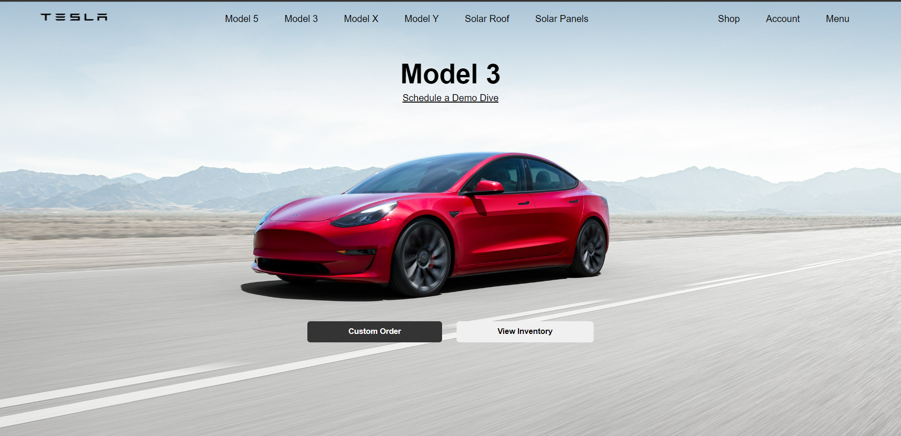
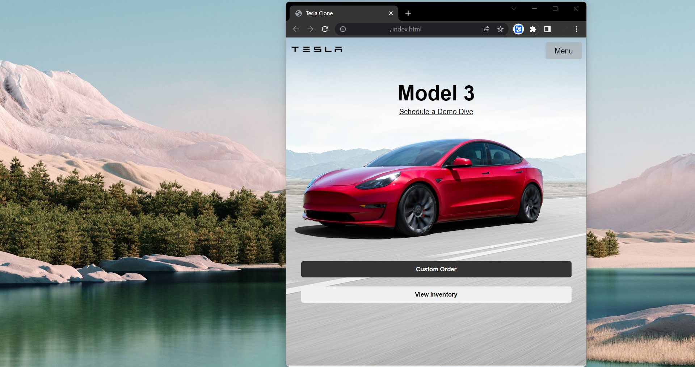

# Página inicial do site da Tesla responsiva.

### Utilizando um arquivo css separado para responsividade, utilizei a propriedade @media screen and (max-width: 748px){} do CSS para fazer com que meu site respondesse caso as dimensões da tela diminuíssem.

### Tecnologias Utilizadas:
- HTML
- CSS

